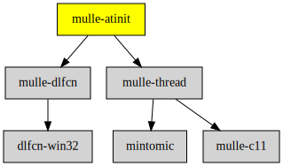

# mulle-atinit

#### 🤱🏼 Compatibility library for deterministic initializers

This is a workaround for dynamic libraries initializers not being properly
sequenced (e.g. an ELF shared library).


| Release Version                                       | Release Notes  | AI Documentation
|-------------------------------------------------------|----------------|---------------
|  [](//github.com/mulle-core/mulle-atinit/actions) | [RELEASENOTES](RELEASENOTES.md) | [DeepWiki for mulle-atinit](https://deepwiki.com/mulle-core/mulle-atinit)


You must **statically** link the mulle-atinit library with your executable.
Ensure that global symbols are exported and that the whole library is linked
to the executable and not optimized away by the linker.

| Platform | Linker Flags
|----------|--------------------------------------------------
| Linux    | `-Wl,--export-dynamic -Wl,--whole-archive`
| macos    | `-force_load <library>`

Any participating shared library constructor uses

``` c
mulle_atinit( f, userinfo, priority);
```

to defer `f` to a later date.


The function `f` will be called properly sequenced before main. `userinfo` will
be passed as the only parameter. You use priority 0 normally. Use higher
priorities to move initializers ahead.

### Missing `dlsym`

If you are linking your executable statically and `dlsym` is not available
(musl) then you must define `__MULLE_STATICALLY_LINKED__`, when building all
dependencies that use `mulle_atinit`. Dynamic linking with a missing `dlsym`
won't work.


### You are here




## Add

Use [mulle-sde](//github.com/mulle-sde) to add mulle-atinit to your project:

``` sh
mulle-sde add github:mulle-core/mulle-atinit
```

To only add the sources of mulle-atinit with dependency
sources use [clib](https://github.com/clibs/clib):


``` sh
clib install --out src/mulle-core mulle-core/mulle-atinit
```

Add `-isystem src/mulle-core` to your `CFLAGS` and compile all the sources that were downloaded with your project.


## Install

Use [mulle-sde](//github.com/mulle-sde) to build and install mulle-atinit and all dependencies:

``` sh
mulle-sde install --prefix /usr/local \
   https://github.com/mulle-core/mulle-atinit/archive/latest.tar.gz
```

### Legacy Installation

#### Requirements

Preferably install mulle-core and be done with it:

| Requirements                                     | Description
|--------------------------------------------------|-----------------------
| [mulle-core](//github.com/mulle-core/mulle-core) |🌋 Almagamated library of mulle-core + mulle-concurrent + mulle-c


Or if you really want to do it exhaustively:

| Requirements                                 | Description
|----------------------------------------------|-----------------------
| [mulle-thread](https://github.com/mulle-concurrent/mulle-thread)             | 🔠 Cross-platform thread/mutex/tss/atomic operations in C
| [mulle-dlfcn](https://github.com/mulle-core/mulle-dlfcn)             | ♿️ Shared library helper

#### Download & Install

Download the latest [tar](https://github.com/mulle-core/mulle-atinit/archive/refs/tags/latest.tar.gz) or [zip](https://github.com/mulle-core/mulle-atinit/archive/refs/tags/latest.zip) archive and unpack it.

Install **mulle-atinit** into `/usr/local` with [cmake](https://cmake.org):

``` sh
PREFIX_DIR="/usr/local"
cmake -B build                               \
      -DMULLE_SDK_PATH="${PREFIX_DIR}"       \
      -DCMAKE_INSTALL_PREFIX="${PREFIX_DIR}" \
      -DCMAKE_PREFIX_PATH="${PREFIX_DIR}"    \
      -DCMAKE_BUILD_TYPE=Release &&
cmake --build build --config Release &&
cmake --install build --config Release
```


## Author

[Nat!](https://mulle-kybernetik.com/weblog) for Mulle kybernetiK  


